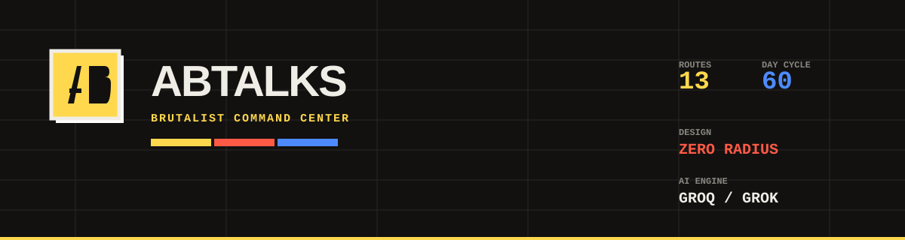
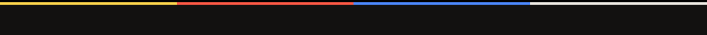

<div align="center">




**[🔗 Live Demo](https://commit-streak-forge.vercel.app/)** · **[📖 In-App Docs](https://commit-streak-forge.vercel.app/docs)** · **[🐛 AI Usage Log](./PROMPTS.md)** · **[📜 Full Build Transcript](./transcript.md)**

</div>



## ▌ The Brief, In One Paragraph

ABTalks runs a **60-day coding challenge** for Indian college students. Students pick a track, build something every day, and maintain a public streak by submitting a **GitHub commit** and a **LinkedIn post**. Most usage happens on a phone, late at night, after college. The product *worked*. **It had never been designed.** This is a solo, ground-up mobile-first redesign built for the ABTalks Vibe Code Hackathon — not a re-skin, a rebuilt system: personalized curriculum, live AI feedback, a recruiter-facing public profile with an AI-written pitch, and a full XP/leveling layer, all inside the brief's explicit constraints (mocked data, no real auth or database).

---

## ▌ Why This Submission Is Built the Way It Is

Every major decision below maps directly to how this hackathon is actually judged — originality, polish, and *how well the AI was steered*, not raw feature count.

| Judging Criterion | How This Submission Addresses It |
|---|---|
| **Mobile-first at 390px** | Every one of 13 routes was built and verified at 390px first, desktop second — this is explicitly what gets automatically screenshotted for evaluation. |
| **Understandable with zero context** | The landing page is written to convince a stranger to commit to 60 days in under 15 seconds — no jargon, no assumed familiarity with ABTalks. |
| **Real edge cases, not happy-path only** | Three distinct, switchable demo profiles make first-day, missed-day, and empty-profile states genuinely demoable — not just theoretically handled. |
| **One genuinely thoughtful original idea** | Several, deliberately: Streak Freeze turns failure into a designed feature; the AI Recruiter Pitch is the most direct fulfillment of ABTalks' *own stated purpose* (recruiter visibility); XP/Levels reframes a 60-day checklist into a visible growth curve. |
| **How well the AI was steered** | The full prompt history — including real course-corrections, rejected feature ideas, and a structured bug-report that diagnosed a real state-management bug — is preserved in [`PROMPTS.md`](./PROMPTS.md) and [`transcript.md`](./transcript.md), not sanitized into a highlight reel. |

---

## ▌ Live Links & Repository Map

| Resource | Link |
|---|---|
| 🌐 **Live Application** | [commit-streak-forge.vercel.app](https://commit-streak-forge.vercel.app/) |
| 💻 **GitHub Repository** | [Sagar44-Github/ABTalks-Redesigned](https://github.com/Sagar44-Github/ABTalks-Redesigned) |
| 📄 **AI Usage Log** | [`PROMPTS.md`](./PROMPTS.md) |
| 📜 **Full Session Transcript** | [`transcript.md`](./transcript.md) |
| 📚 **In-App Documentation** | [/docs](https://commit-streak-forge.vercel.app/docs) |

### Required Submission Route Map
```
/
/dashboard
/day/12
```


## ▌ Every Route, In Depth

### `/` — Landing Page
The first thing a student who's never heard of ABTalks sees. Built to establish trust and motivation fast: a clear hero explaining the format in one sentence, a "how it works" 3-step explainer, a trust/proof section, and a track picker preview — all before asking for commitment. Copy is direct and plain throughout, deliberately avoiding generic hackathon-speak.

### `/onboarding` — Track Selector
Not decorative. Selecting a track here **actually changes** what `/dashboard` and every `/day/$n` page show — different task content, different learning objectives, different auto-drafted captions, per track. This was the first major upgrade past the MVP requirement, specifically because a static "pick a track" that didn't affect anything felt like the biggest missed opportunity in the original brief.

### `/dashboard` — Command Center
The home screen after "login" (mocked). Shows, in priority order: current streak (the hero stat — alive / at-risk / broken states), today's task, a 60-square day-grid with five distinct visual states (completed / missed / frozen / today / upcoming), overall completion %, achievements, XP/Level with a progress bar, and a time-aware nudge banner that changes tone across day/evening/late-night — directly responding to the brief's own detail that real usage skews late-night.

### `/day/$n` — Daily Task Page
Every day, not just Day 12 — a dynamic route. Full task description, learning objectives, GitHub + LinkedIn submission fields with format validation, an **auto-drafted, editable LinkedIn caption** (removes blank-page friction at the exact moment — tired, late at night — a student is most likely to skip posting), live GitHub verification, and **AI-generated submission feedback** once proof is submitted.

### `/history` — Submission History
Full reverse-chronological log of every submission, with real outbound links to what was actually submitted, cached AI feedback re-displayed, and a genuinely designed empty state for a zero-submission profile — not a blank screen.

### `/leaderboard` — Leaderboards
Ranked by streak, filterable by track, showing completion % and Level per row, with the "you" row correctly following whichever demo profile is active.

### `/u/$username` — Public Recruiter Profile
The single most on-brief feature in this whole submission. The brief states ABTalks exists to make students **visible to recruiters** — this page is the direct, public, no-login artifact that delivers on that: streak, Level, badges, real outbound proof-of-work links, and an **AI-generated recruiter pitch** that synthesizes a student's actual track record into 2-3 sentences a recruiter would want to read.

### `/portfolio` — Proof-of-Work Portfolio
A dedicated recruiter-facing showcase distinct from the public profile — verified GitHub commit badges, highlighted projects, and skill proof pulled from completed work.

### `/certificate` — Completion Certificate
A verifiable completion credential with a QR code and track details — gives the 60-day arc a tangible, shareable endpoint.

### `/prep` — AI Interview Prep
AI-generated mock technical interview questions tailored to the specific skills a student has actually completed — directly extending the "prove your knowledge to a recruiter" thread the rest of the product is built around.

### `/squad` — Peer Building Squads
Small-group peer accountability — daily check-ins and a squad-level leaderboard, a more intimate, supportive counterpart to the individual leaderboard.

### `/settings` — Preferences
Track switching, theme mode, evening notification preferences, and public-profile visibility.

### `/docs` — In-App Documentation
Explains ABTalks itself, this redesign's scope, a live rendered reference of the design system, and the reasoning behind key decisions — for anyone (a judge included) who wants the "why," not just the "what."


## ▌ The Three Required Edge Cases

Demoed live via **three distinct, switchable profiles** rather than described only in theory:

| Profile | State | What It Demonstrates |
|---|---|---|
| **Arjun Mehta** | Day 1, zero streak | The dashboard reads as a genuine encouraging start state — "your streak starts today" — never a broken-looking "0." |
| **Riya Nandan** | Mid-challenge, 11-day streak, one frozen day | The day-grid distinguishes completed / missed / **frozen** / today / upcoming as five distinct visual states; the missed-day copy is supportive, never punishing. |
| **Sana Qureshi** | Empty profile, zero submissions ever | Every section that would normally show data — achievements, progress grid, completion % — has a real, designed empty state, not a blank space or an "undefined." |


## ▌ Key Architectural Decisions

### Single Source of Truth for Active Profile
All active-profile state lives in one shared store (`src/lib/store.tsx`). Every route that depends on "who's logged in" — Nav, Dashboard, History, Settings, Leaderboard, Public Profile — reads from this one source and never independently re-initializes it. This mattered enough to be worth a dedicated fix: an earlier version had `/history` silently overwriting the active profile on mount, which cascaded into the Nav bar itself changing without user action. The fix, and the audit that confirmed no other route had the same mistake, are documented in full in [`transcript.md`](./transcript.md).

### One-Shot URL Parameter Sync
`?student=` query params (used for demo-profile deep-linking) are synced to the store **once on mount only**, guarded against re-firing on every store change — preventing the URL from silently overriding a manual profile switch mid-session.

### Dual AI Provider Support
The AI feedback and recruiter-pitch features auto-detect the API key format and route accordingly — keys starting with `gsk_` go to **Groq** (`llama-3.3-70b-versatile`), keys starting with `xai-` go to **xAI Grok** (`grok-3-mini`). Both are called exclusively through server functions (`src/lib/ai.ts`, built on TanStack Start's `createServerFn`) — the key is never exposed client-side. Every AI call has an explicit, tested graceful-fallback path for a missing key, timeout, or rate limit.

### Deterministic XP → Level Derivation
Level is **never stored independently** — it's always computed live from cumulative XP via a fixed lookup curve (`src/lib/xp.ts`). This guarantees XP and Level can never drift out of sync, a common bug class in gamification systems that store both values separately.


## ▌ Full Feature Matrix

### 🟨 Core & Required Original Ideas
- **Streak Freeze** — a limited protection token that turns a missed day into a distinct `frozen` state instead of breaking the streak, visible on the day-grid and the dashboard token counter, not just a backend rule
- **Auto-Drafted LinkedIn Caption** — pre-filled, editable, generated from the day's actual task content

### 🟦 Visibility & Recruiter Features
- **AI Recruiter Pitch** — live Grok/Groq synthesis of a student's track, streak, and completed work into a genuine recruiter pitch
- **AI Submission Feedback** — short, task-aware encouragement generated live after each submission
- **Proof-of-Work Portfolio** — verified GitHub badges and highlighted projects
- **Completion Certificate** — a QR-verifiable credential
- **AI Interview Prep** — mock questions generated from actually-completed curriculum
- **Peer Building Squads** — small-group daily accountability

### 🟥 Platform Infrastructure
- **XP & Levels** — a full 10-level curve with escalating XP thresholds, level-up celebrations, and consistent display across dashboard, profile, and leaderboard
- **Live GitHub Verification** (`src/lib/github.functions.ts`) — real commit/repo checks via the GitHub REST API
- **Time-Aware Nudge Banner** — day / evening / late-night tone shifts
- **PWA Ready** — manifest, service worker, mobile-first viewport
- **Custom 404 & Error Boundaries** — fully restyled to match the brutalist system, since a mistyped URL is a realistic thing to hit during evaluation
- **Full Light + Dark Mode** — dark mode is an original extension; the reference design has none


## ▌ Design System — "Brutalist Command Center"

Cloned from a reference design system's extracted tokens, then extended with an original dark mode. Industrial, high-contrast, zero-curve, hard-edged — deliberately the opposite of a soft default SaaS look.

<table>
<tr><td width="50%">

**Light Mode**
| Token | Hex |
|---|---|
| 🟨 Accent Yellow | `#FFCC00` |
| 🟥 Accent Red | `#E63B2E` |
| 🟦 Accent Blue | `#0055FF` |
| ⬛ Pure Black | `#000000` |
| Ink | `#1A1A1A` |
| Background | `#F5F0E8` |
| Card Surface | `#FFFFFF` |
| Sidebar Surface | `#EFECE6` |

</td><td width="50%">

**Dark Mode** *(original extension)*
| Token | Hex |
|---|---|
| 🟨 Accent Yellow | `#FFD84D` |
| 🟥 Accent Red | `#FF5A46` |
| 🟦 Accent Blue | `#4D8AFF` |
| ⬜ Pure White | `#FFFFFF` |
| Ink | `#F0EDE6` |
| Background | `#121110` |
| Card Surface | `#201E1B` |
| Sidebar Surface | `#181715` |

</td></tr>
</table>

**Signature rules**
- **Zero border-radius** on every interactive element — buttons, inputs, badges, nav
- **Hard offset shadows** (`4px 4px 0px`, no blur) instead of soft elevation
- **Space Grotesk** (weight 900) for headlines, **JetBrains Mono** for technical labels/status chips, **Inter** for body copy
- Tricolor accents used **semantically** — yellow for primary actions/milestones, red for alerts/missed states, blue for stats/streak counts — never decoratively
- Every color pair verified against **WCAG AA (4.5:1)** contrast in both modes

> **A note on this README's own styling**: GitHub-flavored Markdown strips custom fonts and inline CSS from rendered READMEs, so the page itself can't literally inherit the app's dark canvas or Space Grotesk type. The banner and divider graphics above are custom SVGs built with the app's exact hex values and hard-shadow geometry — the closest honest approximation of "same theme" achievable within GitHub's rendering constraints.


## ▌ Tech Stack

| Layer | Technology |
|---|---|
| Framework | TanStack Start / TanStack Router + React 19 |
| Build System | Vite + Nitro (Vercel preset, `.vercel/output`) |
| Styling | Tailwind CSS v4 + custom CSS variables |
| Fonts | Space Grotesk · Inter · JetBrains Mono |
| Icons | Lucide React |
| AI | Groq (`llama-3.3-70b-versatile`) / xAI Grok (`grok-3-mini`), auto-detected by key format |
| Data | Mocked JSON — no database |
| Auth | None (explicitly out of scope per the brief) |
| Hosting | Vercel |

---

## ▌ Running Locally

```bash
git clone https://github.com/Sagar44-Github/ABTalks-Redesigned.git
cd ABTalks-Redesigned
npm install

# Optional — enables live AI features:
echo "GROQ_API_KEY=gsk_your_key_here" > .env
# or
echo "GROK_API_KEY=xai-your_key_here" > .env

npm run dev   # → http://localhost:5173
npm run build # → production build via Nitro's Vercel preset
```

No environment variables are required for the core application — every route works fully on mocked data alone. The AI features degrade gracefully with a clear fallback message if no key is present.

---

## ▌ Explicitly Out of Scope

Per the challenge brief:
- Real backend authentication or persistent database
- A recruiter-facing login/admin dashboard
- Live GitHub webhook integration (verification is via REST API calls, not webhooks)

---

## ▌ AI Usage & Build Process

This project was built solo, "vibe-coded" across two categories of AI tools:

- **Claude** — problem-statement analysis, the full design-system specification, all feature specs across four build phases, bug-report diagnosis, and documentation
- **Lovable and Antigravity (Gemini)** — implementation, switched between as needed against the same GitHub repository

The complete, honest history — including rejected feature ideas, real course-corrections, and the structured diagnosis of a real state-management bug — is preserved in full in [`PROMPTS.md`](./PROMPTS.md) and [`transcript.md`](./transcript.md), not condensed into a highlight reel.

<div align="center">
<br/>


**Built solo for the ABTalks Vibe Code Hackathon** · August 2026


</div>